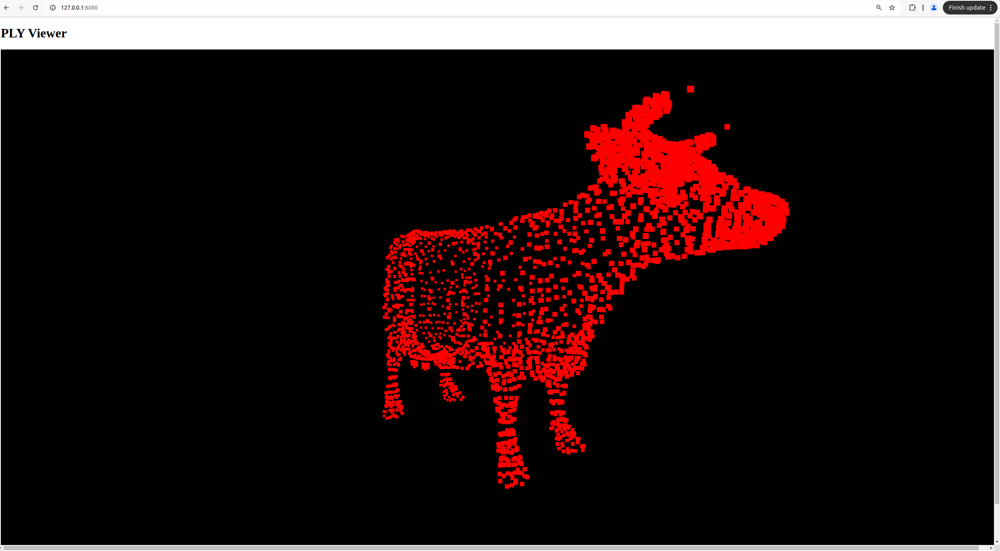
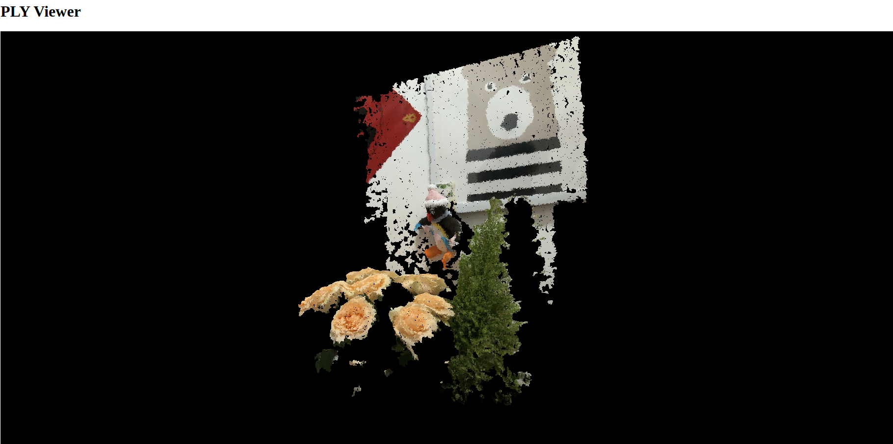

# Rust Yew Trunk Three.js: visualize point cloud on web!

One example:

Another example:

These are  example screenshots of how the point cloud looks like in web. 


Other guide:
This is a fairly minimal template for a Yew app that's built with [Trunk].

## Trunk Yew Usage

For a more thorough explanation of Trunk and its features, please head over to the [repository][trunk].

### Installation

If you don't already have it installed, it's time to install Rust: <https://www.rust-lang.org/tools/install>.
The rest of this guide assumes a typical Rust installation which contains both `rustup` and Cargo.

To compile Rust to WASM, we need to have the `wasm32-unknown-unknown` target installed.
If you don't already have it, install it with the following command:

```bash
rustup target add wasm32-unknown-unknown
```

Now that we have our basics covered, it's time to install the star of the show: [Trunk].
Simply run the following command to install it:

```bash
cargo install trunk wasm-bindgen-cli
```

That's it, we're done!

### Running

```bash
trunk serve
```

Rebuilds the app whenever a change is detected and runs a local server to host it.

There's also the `trunk watch` command which does the same thing but without hosting it.

### Release

```bash
trunk build --release
```

This builds the app in release mode similar to `cargo build --release`.
You can also pass the `--release` flag to `trunk serve` if you need to get every last drop of performance.

Unless overwritten, the output will be located in the `dist` directory.

## Using this template

There are a few things you have to adjust when adopting this template.

### Remove example code

The code in [src/main.rs](src/main.rs) specific to the example is limited to only the `view` method.
There is, however, a fair bit of Sass in [index.scss](index.scss) you can remove.

### Update metadata

Update the `name`, `version`, `description` and `repository` fields in the [Cargo.toml](Cargo.toml) file.
The [index.html](index.html) file also contains a `<title>` tag that needs updating.

Finally, you should update this very `README` file to be about your app.

### License

The template ships with both the Apache and MIT license.
If you don't want to have your app dual licensed, just remove one (or both) of the files and update the `license` field in `Cargo.toml`.

There are two empty spaces in the MIT license you need to fill out: `{{year}}` and `{{authors}}`.

[trunk]: https://github.com/thedodd/trunk
